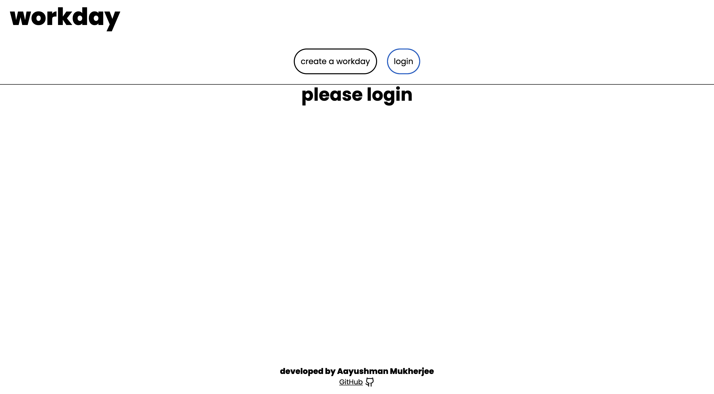
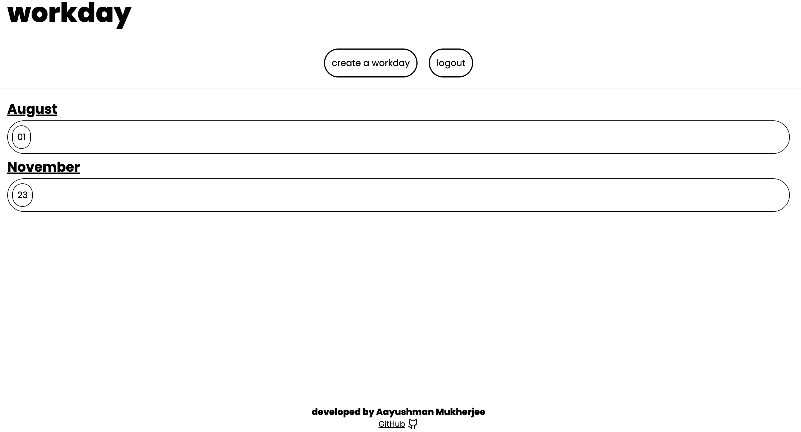
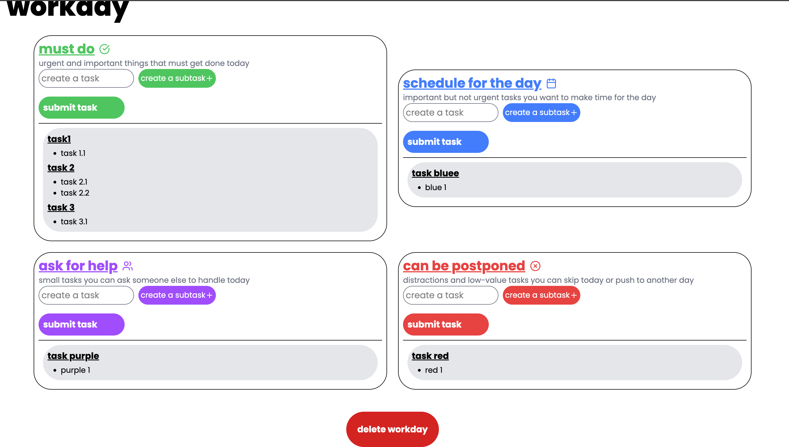

# **Workday**
Workday is a day-to-day task management app implementing Eisenhower Matrix system.

Each day's tasks are divided into four groups:
- **Must do** - Urgent and important things that must get done on that day.
- **Schedule for the day** - Important but not urgent tasks you want to make time for the day.
- **Ask for help** - Small tasks you can ask someone else to handle.
- **Can be postponed** - Distractions and low-value tasks you can skip for the day or push to another day.

# **Preview and Guide**
## Login Page

Login with an unique passkey to your account.

## All Tasks Page

- `create a workday` - click on this button to create a workday in MM/DD format (for example 08/01 for 1st August).
- Click on a particular day to view or add tasks for that day.

## A Particular Day

- Create a task in one of the four categories according to the urgency of the task, you can also add subtasks by clicking on `create a subtask+` button. Finally click on `submit task` button to view the task.
- After the day is over delete the workday by clicking on `delete workday` button at the bottom of the page.

# **Website link**
[Try Workday](https://workday-bay.vercel.app)
